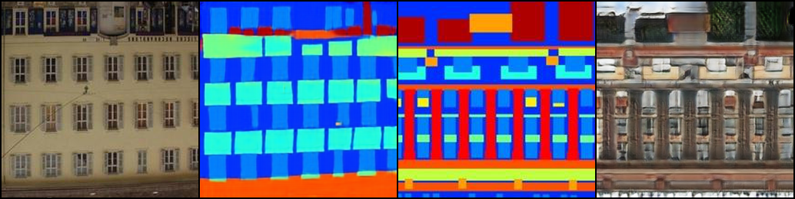

# Auxiliary-Classifier-Cycle-GAN
## Intro
In this project, I combine the CycleGAN with ACGAN concept that I modified the disciminator inside the CycleGAN.

## Installation
- Ubuntu 18.04
- pytorch 1.4.0
```bash
pip install -r requirements.txt
```

## Result


## Run the project
```bash
chmod +x run.sh
./run.sh
```

## Tensorboard
```bash
tensorboard --logdir logs
```